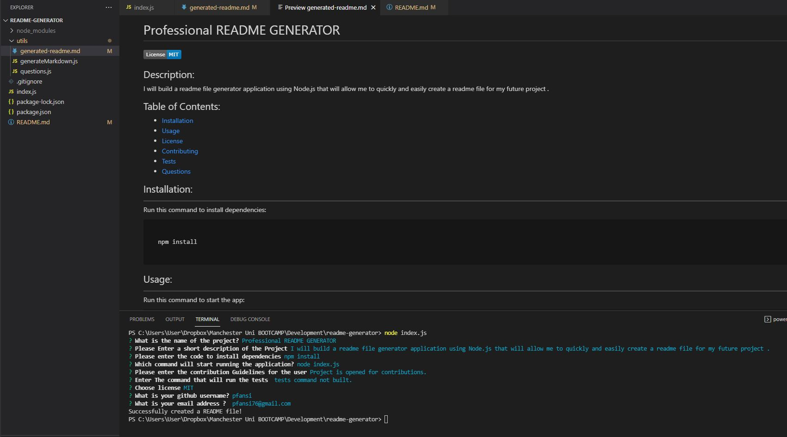

# Professional Reame File generator

## Git Repository

I created a git repository folder that will host the finished project. The Repository will be found [here](https://github.com/pfansi/readme-generator)

## Link to the walktrough video functionality

Application video [demo](https://watch.screencastify.com/v/aTk4SiPgq2Lq4gRN6qjc)

## Link to the generated readme.md file

To view the generated Markdown file [Click here](https://github.com/pfansi/readme-generator/blob/main/utils/generated-readme.md)

## Task Description

I will build a readme file generator application using Node.js that will allow me to quickly and easily create a readme file for my future project .
The command-line application will take the user inputs and dynamically generate the readme file.

## Pseudo code description

- WHEN npm is install and my application loaded using node
- I am then prompted with input request
- When i entered these input , they will be added to the relevant section of my readme file
- When i have finished with all the input
- The application should then generate a readme file describing my application
- If there is any issue , i t should prompt me with an error message.

## What have you done

- Created the repository for the app in GitHub and readme.md file to describe the different building phases of the application.- I have created the gitignore file and have untracked the node_module and the .DS_Store.
- I ran npm init and npm install to create the package.json file and the node_modules.
- Researched the most popular licenses and Created the questions files that will be exported as a module.

* Created the index.js file
* I have installed all the node module require for the app and created a function to initialize the application.
* Created the generateMarkdown file that will handle and generate the template readme file
* Create the function that will render the License badge and License links based on the user license choice.
* Added style to the generated readme file.

## Screenshots

- This is the screenshot of the final application. 
